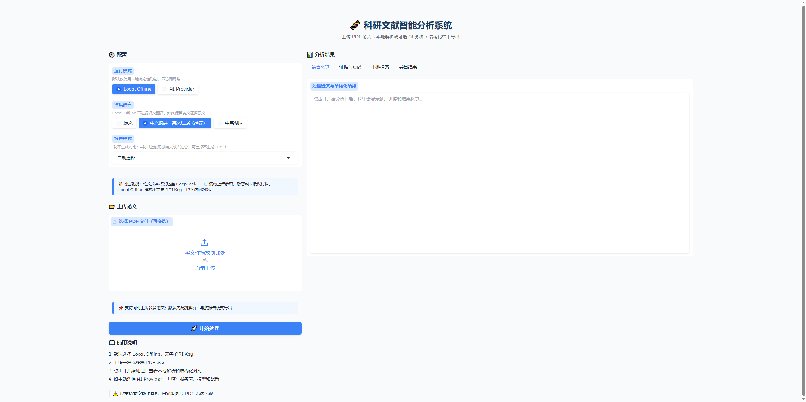
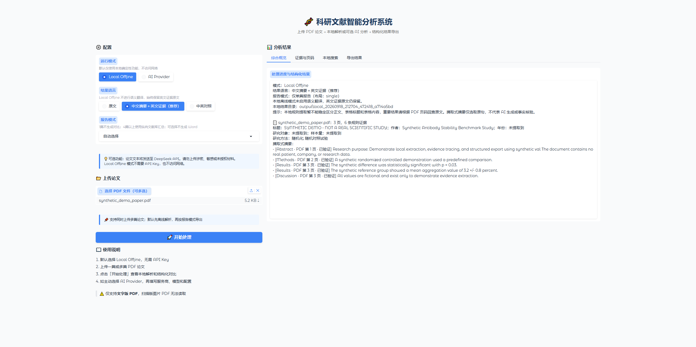
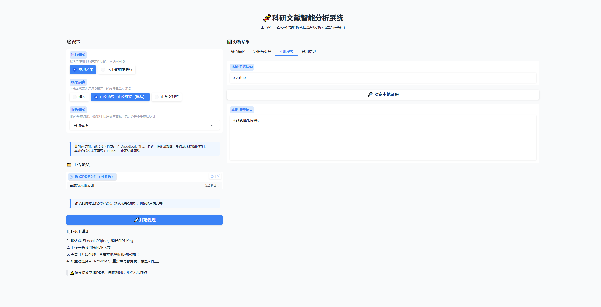
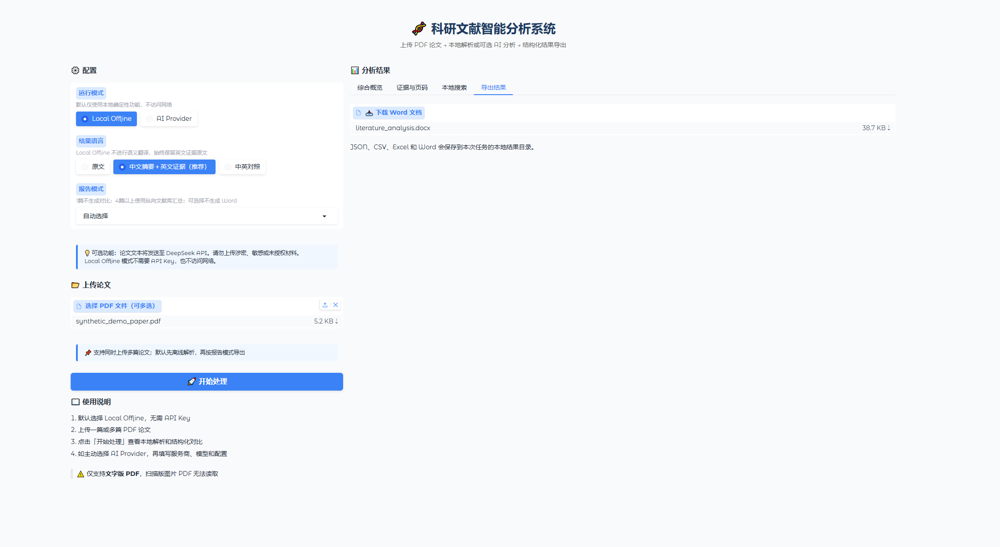

# Local-First Literature Evidence Assistant — v0.4.0 Evidence Retrieval Preview

当前版本：`v0.4.0-evidence-retrieval-preview`（Unreleased）

一个本地优先的文献证据整理工具：从文字版 PDF 提取物理页、按章节组织 passage，使用 SQLite FTS5 检索，并可选择本地语义检索和 RRF 混合排序。结果保留原文证据与 PDF 物理页码，便于人工回查。

> **版本边界**：v0.4 是 Evidence Retrieval Preview，不是稳定版或科研生产系统。默认 Local Offline 不联网；Provider Grounded QA 仍为 Experimental，不能替代科研人员判断。

## 当前能力概览

- Batch-scoped Evidence Search：检索只属于当前批次；
- Section-aware Evidence Passage Retrieval：保留章节、文件和物理页码；
- Lexical / FTS5：默认检索方式，适合精确关键词和统计表达；
- Hybrid Local：可选本地 embedding + RRF，不自动下载或加载模型；
- Local embedding cache：按批次、文本和模型指纹隔离；
- Evidence Pack 与 Evidence Only QA：默认只展示检索到的证据，不生成自然语言结论；
- 程序控制的 source、section 和 physical PDF page provenance；
- 规则型科研事实提取、批量处理、暂停续跑和 JSON/CSV/Excel/Word 导出；
- 可选 Experimental Provider Grounded QA：仅在用户主动选择 Provider 后使用。

## v0.3 大批量与双语能力

- 默认 `Local Offline`，不需要 API Key；
- 单篇论文离线整理；
- 2～3 篇简洁对比；
- 4 篇以上文献库汇总；
- 11 篇以上采用大文献库布局；
- Word 最多展示 10 篇代表论文详情；
- Excel、JSON 和独立报告保留全部成功论文；
- 报告模式：自动选择、单篇报告、简洁对比、文献库汇总、仅 Excel/JSON；
- 文件内容指纹去重；
- 同名不同内容论文分别处理；
- 同内容不同文件名识别为重复输入；
- 单篇失败不影响其他论文；
- 批处理暂停和续跑；
- 原子保存 manifest、任务状态和缓存；
- 独立论文报告；
- Word、Excel、JSON、CSV 导出；
- 可选中英对照展示；
- DeepSeek、OpenAI、Ollama 和 Custom OpenAI-Compatible Provider 架构。

## v0.4 检索模式

| Capability | Status |
| --- | --- |
| Batch-scoped lexical retrieval | Validated |
| Section-aware passage retrieval | Validated |
| Physical PDF page provenance | Validated |
| Local embedding backend | Validated on controlled synthetic benchmark |
| Hybrid RRF | Validated on controlled synthetic benchmark |
| Evidence Only QA | Validated |
| Experimental Provider Grounded QA | Experimental |
| Real biomedical corpus validation | Not completed |
| OCR | Not supported |
| Scientific truth validation | Not supported |

### Evidence Only 与 Experimental Provider Grounded QA

`Evidence Only` 是默认 QA 模式：只展示当前批次检索到的 Evidence Pack 和程序绑定的来源信息，不调用 Provider。

`Experimental Provider Grounded QA` 是实验性架构，包含严格 Evidence ID、程序本地引用校验和有限的 Synthetic live-provider 测试。DeepSeek 的 transport 与 post-normalization supported case 已真实成功，但 adversarial combined prompt-injection 场景尚未完成，完整真实 Provider Grounded QA 仍未通过端到端验收。

`verified=true` 只表示原始提取文本与对应 PDF 页面的完全匹配；citation 只表示回答指向了检索 passage，并由程序绑定 source、section 和 PDF 物理页码。它不表示科研事实、语义蕴含、同行评审、重复验证或临床有效性。

## 检索架构

```text
PDF
↓
Physical-page extraction
↓
Section-aware passages
↓
Batch-scoped SQLite
↓
┌──────────────────────────┐
│ Lexical / FTS5           │
│ Optional Local Embedding │
└──────────────────────────┘
↓
RRF Hybrid Retrieval
↓
Evidence Pack
↓
Evidence Only
    OR
Experimental Provider Grounded QA
↓
Program-bound citations
```

## 大批量工作流

面向普通用户的操作流程：

1. 启动 `start_local.bat`；
2. 保持默认 `Local Offline`；
3. 上传文字版 PDF；
4. 选择“自动选择”或“文献库汇总”；
5. 开始本地处理；
6. 查看任务状态和失败论文；
7. 下载 Word、Excel、JSON 或独立论文报告；
8. 需要 AI 翻译或生成式分析时，再主动选择 AI Provider。

需要明确的三点：

- **30 篇论文不会生成 31 列横向 Word 表格**。4 篇以上使用「一篇论文一行」的纵向汇总布局，因此表格列数不随论文数量增长；超过 10 篇时 Word 只展开代表性论文详情，并注明完整数据所在的结构化文件。
- **Word 用于阅读代表论文和总体情况**；**Excel/JSON 用于保存完整文献库信息**。只有 Word 会裁剪展示范围，Excel、JSON 和独立论文报告保留全部成功论文。
- **失败论文会保留错误状态，但不会生成虚假的正常报告**。失败论文被排除在 Word 代表论文选择和独立报告生成之外，其错误信息记录在 manifest、`status.json` 和 Excel 的输入映射/技术明细中。

## 双语与隐私边界

- `Local Offline` 不访问网络，不创建 Provider 客户端；
- `Lexical / FTS5` 检索完全在本地完成；
- `Hybrid Local` 使用用户已准备的本地 SentenceTransformer 目录，需安装可选语义依赖并显式构建当前批次索引；
- 项目不会自动下载 embedding 模型，也不会在上传 PDF 时自动加载模型；
- `Evidence Only` 不发送 Provider 请求；
- **本地离线模式不会自动完成语义翻译**。报告使用中文字段名，并原样保留英文证据原文、PDF 物理页码和 `verified` 状态；
- 中英对照翻译需要用户主动选择 AI Provider；
- 使用远程 Provider 时，选中的论文文本会发送给对应服务商；
- Experimental Provider Grounded QA 只发送当前选中的 EvidencePack snippets，不发送整篇 PDF；
- API Key 仅在当前会话内存中使用；
- API Key 不写入结果、SQLite、日志或 `.env`；
- Ollama 可作为本地模型入口，但真实兼容性仍需用户自行验证。

## 验证状态

| 功能 | 当前状态 |
| --- | --- |
| Local Offline 单篇/双篇真实 PDF | Limited Pilot PASS |
| 30 输入批处理身份与导出 | Synthetic Corpus PASS |
| DeepSeek 合成 PDF | Controlled Test PASS |
| DeepSeek 真实长论文 | Experimental / Not E2E PASS |
| OpenAI | Mock Verified |
| Ollama | Mock Verified |
| Custom Endpoint | Mock Verified |
| OCR | Not Implemented |
| 复杂表格识别 | Limited |

上述状态不夸大真实验证范围：`Synthetic Corpus PASS` 指合成验收语料，不代表真实论文规模验收；OpenAI、Ollama 和 Custom Endpoint 目前为 Mock 验证。详细数据见 `docs/v0.3_validation.md`。

## 受控语义检索 benchmark

该 benchmark 使用 80 条程序生成 passage 和 60 个人工判定 query，覆盖 Exact、Paraphrase、Biomedical 和 Hard Negative。FTS5 在精确查询上表现强，semantic retrieval 改善了部分语义召回，Hybrid RRF 用于组合 lexical 与 semantic 候选。

PubMedBERT is the current project-recommended profile based on a controlled synthetic retrieval benchmark. 这只是当前受控 benchmark 的质量优先建议，不是“最佳 biomedical model”，也未在真实 biomedical corpus 上验证。完整指标见 [`docs/v0.4_embedding_benchmark.md`](docs/v0.4_embedding_benchmark.md)。

## 已知限制

- 仅支持文字版 PDF；
- 扫描件无 OCR；
- 复杂表格、公式和图像识别不稳定；
- 语义检索 benchmark 主要使用合成数据，尚未完成真实 biomedical corpus 验证；
- 没有生产规模的向量索引，当前 semantic passage 上限为 10,000；
- 可选语义依赖较重，需要用户自行准备本地模型目录；
- 规则型事实提取不等于科研事实核验；
- `verified=true` 只代表证据原文可在对应 PDF 页找到；
- citation validation 不等于 semantic entailment；
- 不证明研究结论真实或可靠，也不保证没有模型幻觉；
- 不替代科研人员判断；
- 大文献库验收主要使用合成 PDF；
- 真实论文 Local Offline 验证目前规模有限；
- Provider Grounded QA 仍属于实验功能，完整 adversarial live validation 尚未完成；
- OpenAI、Ollama 和 Custom Endpoint 主要完成 Mock 验证；
- AI 长论文分析仍属于实验功能。

## 核心能力

- Local Offline 默认运行，无 API Key、默认不联网；
- PyMuPDF 分页提取、页面边界保留和长文 chunk；
- 按批次隔离的 section-aware passage 检索；
- 元数据、章节和保守规则型科研事实识别；
- `raw_text` / `display_text` 双层文本；
- `verified` evidence 与 PDF 物理页码追溯；
- SQLite FTS5 本地全文检索；
- 可选本地 SentenceTransformer embedding、embedding cache 和 RRF Hybrid Retrieval；
- 只摘取原句的摘取式摘要；
- 多论文结构化对比；
- 可选报告模式：自动选择、仅单篇报告、简洁对比、文献库汇总，或仅导出 Excel/JSON；
- 4 篇以上自动使用一篇论文一行的纵向汇总，超过 10 篇的 Word 只展示代表性论文；
- 大批量离线批次支持 `batch_manifest.json`、逐篇结果缓存、暂停和续跑；
- JSON、CSV、Excel、Word 导出；
- 可选 DeepSeek、OpenAI、Ollama 和 Custom OpenAI-Compatible Provider。

## 双语报告与语言模式

- `Local Offline` 是默认模式，不需要 API Key；报告使用中文字段名，同时保留英文证据原文、PDF 物理页码和 `verified` 状态；
- `原文` 模式适合直接回查英文论文；
- `中文摘要＋英文证据` 和 `中英对照` 只在用户主动选择并使用 AI Provider 时提供可选机器翻译；
- 中文译文仅供阅读，不改变英文原文、页码或 `verified`；翻译失败时保留英文；
- Word 报告包含基础信息、结构化概览、摘取式摘要和关键证据，可用于人工复核和求职展示；
- Local Offline 报告会明确标注“未启用语义翻译”，不会把规则提取描述为 AI 综述。

## 隐私与可信边界

Local Offline 只读取本地文件，不访问网络，也不上传论文。选择 AI Provider 后，论文文本会发送至对应服务商；建议只使用公开、脱敏且获授权的材料。

`verified=true` 只表示候选证据文本与 PDF 原文匹配，不表示科研事实或结论真实。AI 输出是不可信输入，页码和 verified 由程序处理。AI 模式默认 Fail-Fast，动态 Request Plan 不保证初始估算就是最终请求数；用户设定的 hard limit 不会自动扩大。

## 安装

Windows PowerShell：

```powershell
python -m venv .venv
.venv\Scripts\python.exe -m pip install --upgrade pip
.venv\Scripts\python.exe -m pip install -r requirements.txt
.venv\Scripts\python.exe -m pip check
```

项目不会自动安装依赖，也不会自动配置代理或 Provider。

如需显式启用 `Hybrid Local`，在本地另行安装可选语义依赖，并准备已经存在于本机的 SentenceTransformer 模型目录：

```powershell
.venv\Scripts\python.exe -m pip install -r requirements-semantic.txt
```

项目不会自动下载模型；未安装可选依赖或未构建当前批次语义索引时，`Lexical / FTS5` 仍可用。

## Windows 启动

推荐双击 `start_local.bat`，或在项目根目录运行：

```powershell
.venv\Scripts\python.exe paper_claude.py
```

服务默认绑定 `127.0.0.1`，浏览器访问 `http://127.0.0.1:7860`。启动后保持默认的 `Local Offline` 模式即可无 Key 使用。

## 使用流程

1. 启动程序并确认运行模式为 `Local Offline`。
2. 上传一篇或多篇文字版 PDF。
3. 点击“开始处理”，查看分页提取、章节、事实和证据页码。
4. 使用本地证据搜索查找关键词或统计表达式。
5. 在“报告模式”中选择单篇、简洁对比、文献库汇总或跳过 Word。
6. 下载 JSON、CSV、Excel 或 Word 结构化结果；大批量任务的完整数据以 JSON/Excel 为准。
7. 如主动选择 AI Provider，先勾选具体论文、查看本地请求估算，再确认论文文本会离开本机。
8. 重要结果根据 PDF 页码回查原文。

## 项目结构

```text
paper_claude.py       Gradio 兼容入口和界面
paper_pipeline.py     分页、chunk 和 AI Map-Reduce 管线
report_modes.py       报告模式和布局规划
batch_manager.py      本地批次缓存、暂停和续跑
providers/            Provider 接口、注册和适配器
local_extractor.py    本地 PDF 提取和元数据
section_parser.py     保守章节识别
scientific_facts.py   规则型科研事实与证据
local_search.py       SQLite FTS5 本地搜索
local_summary.py      多论文对比和摘取式摘要
exporters.py          JSON/CSV/Excel/Word 导出
tests/                离线自动化测试
docs/images/          README 截图位置
```

## 测试

```powershell
.venv\Scripts\python.exe -m pytest -q
```

当前版本离线回归结果：293 passed, 15 warnings。测试不调用真实 Provider/API。

## 技术亮点

- 可追溯的原文证据和 PDF 物理页码；
- 本地优先、AI 可选的隐私设计；
- 长文 Map-Reduce AI 管线；
- Provider 会话隔离、输出 Token 预算和请求硬上限；
- 文档提示注入隔离；
- 全局 Fail-Fast 与动态归并规划；
- 基于内容 SHA-256 的稳定 `document_id` 与输入/文档两层身份模型；
- 原子写入 manifest、状态和逐篇缓存；
- 自动化测试和真实 PDF 离线验收。

## Demo 截图

以下截图来自真实运行的 `Local Offline` 模式，输入为明确标注的
`Synthetic Demo PDF`。截图不包含真实论文、用户数据或 API 请求，
仅用于展示 v0.3 local workflow 的本地解析、证据搜索和导出界面；它们不是 v0.4 Hybrid 或 Provider Grounded QA 截图：









重要边界：Local Offline 不上传论文；截图中的 Synthetic Demo 内容仅用于
产品演示，不代表真实科研结果。请勿提交含有本地绝对路径、用户名、敏感
文件名或 API Key 的截图。

## 后续路线

后续可独立评估 OCR、复杂表格识别、更大规模真实语料验证、人工反馈工作流和更完整的本地 QA 体验；这些功能不属于当前 Evidence Retrieval Preview。
